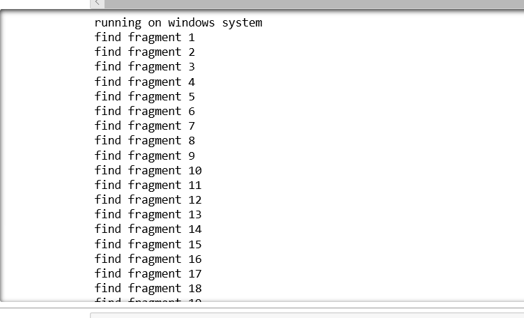
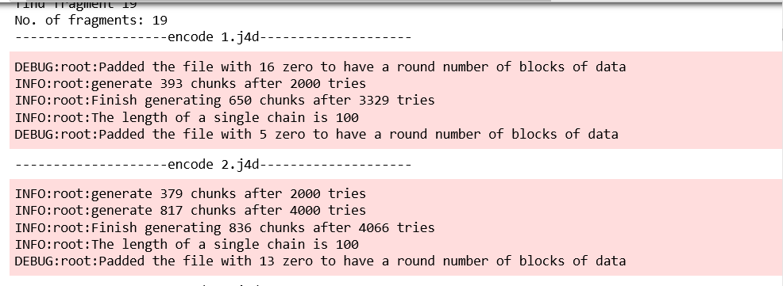
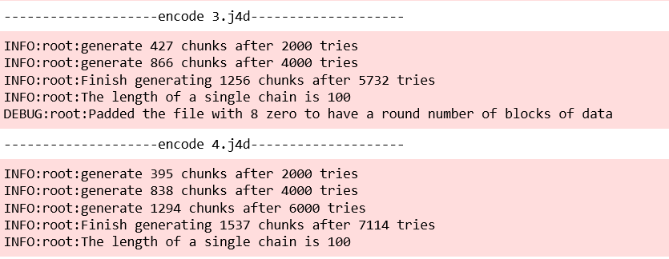
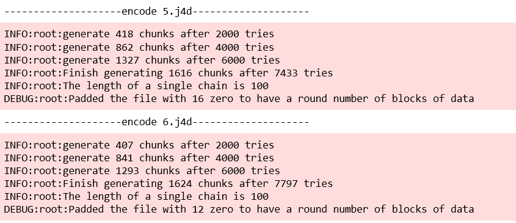
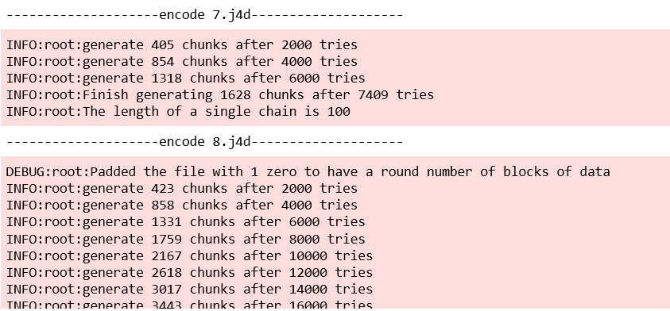
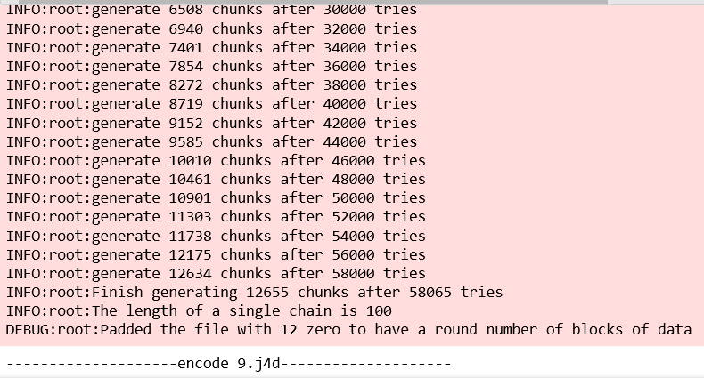
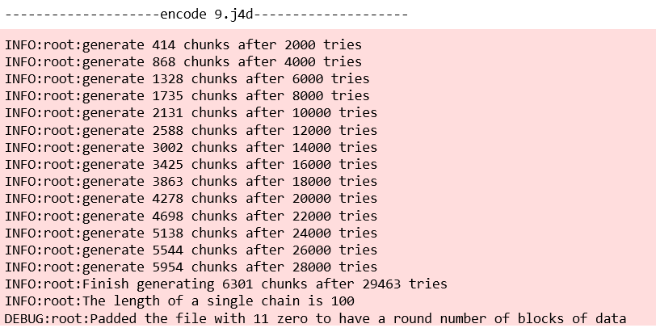
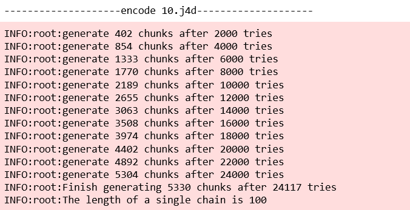
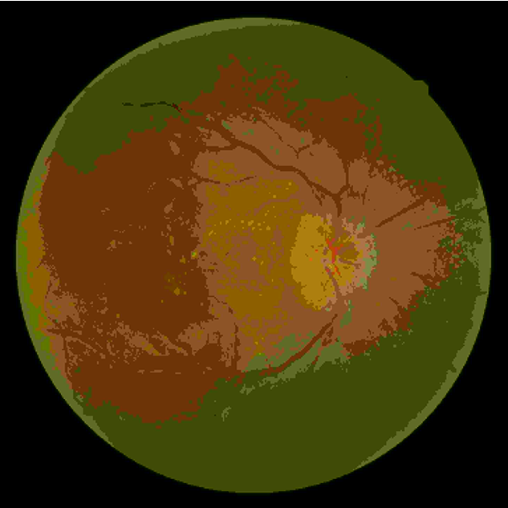
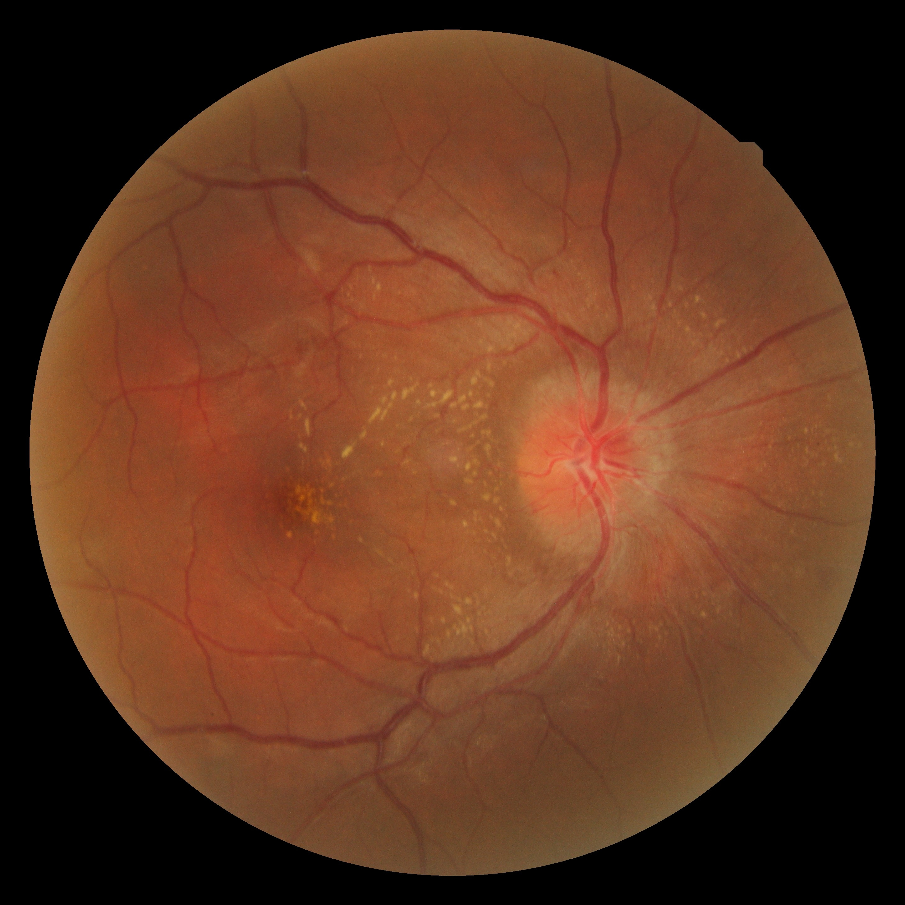

# problem 2 :  Decoding image progressively 

All you need to run is a jupyter notebook called **"J4D.ipynb"** then, run **"main.ipynb"** 

An image split into 19 fragments then the output of decoding progressively will be shown during run "main.ipynb" notebook

## Output
19 progressively decoded pictures will be saved direcrly inside output folder inside j4d folder as j4d files, you can open these files with any broser like chrome as html pages. 
 
### The first picter after decoding

### The last picter after decoding

